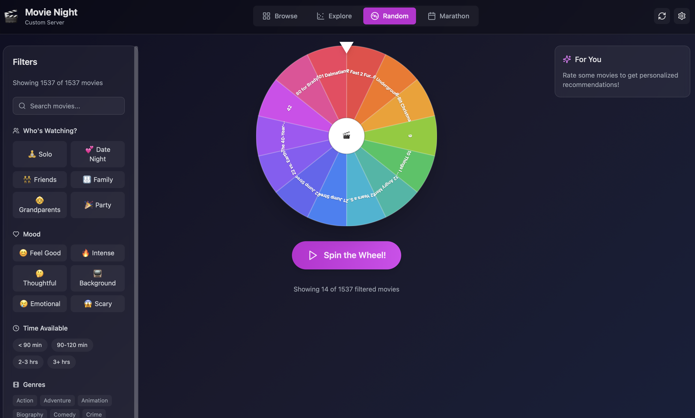
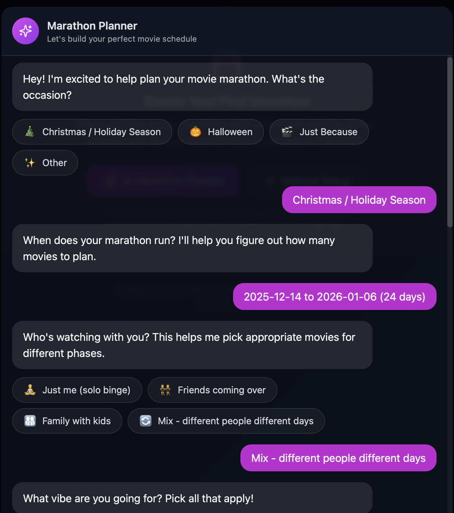
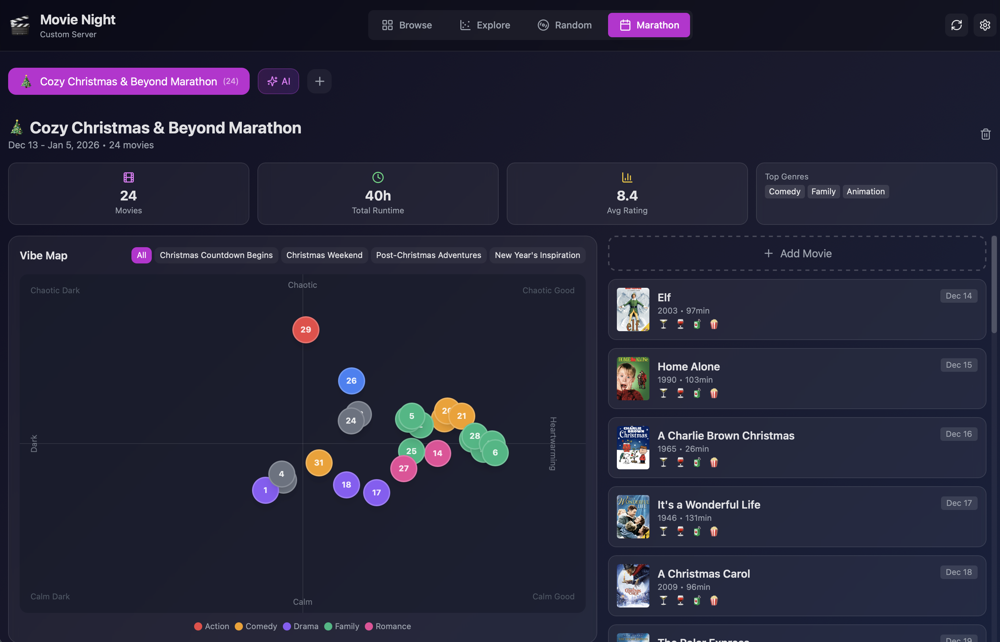

# Movie Night

A movie night planner that connects to your Plex library. Browse your collection, plan movie marathons, and get AI-powered drink and food pairing suggestions.

 

## Features

- **Browse Movies**: Filter by genre, duration, mood, and occasion
- **AI Marathon Planner**: Conversational AI that builds personalized movie schedules based on your preferences, who's watching, and special occasions
- **Drink & Food Pairings**: AI-generated cocktail, wine/beer, and mocktail suggestions for each movie, plus snack ideas
- **Movie Ratings**: Rate movies and track what you've watched
- **Scatter Plot Visualization**: See your marathon plotted by "vibe" (dark to heartwarming, calm to chaotic)
- **Cross-Device Sync**: SQLite database persists ratings, marathons, and cached pairings

## Screenshots


*Spin the wheel to pick a random movie, with filters for mood, audience, and time available*


*AI-powered marathon planner builds personalized movie schedules through conversation*


*View your planned marathon with a vibe map visualization and drink/food pairings*

## Quick Start with Docker

### Using Docker Compose

```bash
docker-compose up -d
```

Open `http://localhost:3001` and click Settings to configure Plex and API keys.

### Using Pre-built Image

```bash
docker run -d \
  -p 3001:3001 \
  -v movie-data:/app/data \
  ghcr.io/jsb2092/movie-night:latest
```

### TrueNAS Scale

1. Add a new custom app
2. Image: `ghcr.io/jsb2092/movie-night:latest`
3. Port: `3001:3001`
4. Storage: Mount a dataset to `/app/data` for database persistence

## Configuration

All configuration is done through the Settings UI in the app:

1. Click the Settings gear icon
2. **Plex**: Click "Login with Plex" → authorize in browser → select your server
3. **Claude API Key**: (Optional) Paste your Anthropic API key for AI features

Credentials are stored in your browser's local storage.

### Environment Variables (Optional)

For advanced setups, these can be set via environment:

| Variable | Default | Description |
|----------|---------|-------------|
| `DATA_DIR` | `./data` | SQLite database location |
| `PORT` | `3001` | Server port |
| `PLEX_URL` | - | Override Plex server URL |
| `PLEX_TOKEN` | - | Override Plex auth token |
| `ANTHROPIC_API_KEY` | - | Override Claude API key |

## Development

### Prerequisites

- Node.js 20+
- npm

### Setup

```bash
# Install all dependencies
npm run install:all

# Create .env in server directory
cp .env.example server/.env
# Edit server/.env with your credentials

# Start development servers
npm run dev
```

The app will be available at `http://localhost:5173` (client) with API at `http://localhost:3001`.

### Project Structure

```
movie-app/
├── client/                 # React frontend (Vite + TailwindCSS)
│   ├── src/
│   │   ├── components/    # UI components
│   │   ├── hooks/         # Custom React hooks
│   │   └── types/         # TypeScript types
├── server/                 # Express backend
│   ├── src/
│   │   ├── routes/        # API endpoints
│   │   └── services/      # Business logic (Plex, Claude, DB)
└── docker-compose.yml
```

### Building for Production

```bash
# Build client
cd client && npm run build

# Build server
cd server && npm run build

# Start production server
cd server && npm start
```

## Tech Stack

- **Frontend**: React, TypeScript, TailwindCSS, Vite
- **Backend**: Express, TypeScript
- **Database**: SQLite (better-sqlite3)
- **AI**: Anthropic Claude API
- **Media**: Plex API

## License

MIT
